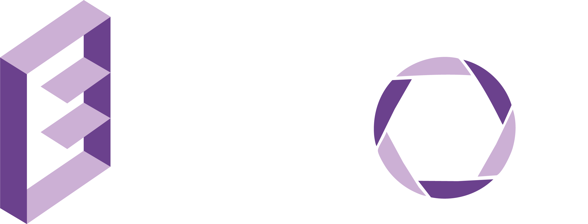

# E-Shelf

<p align="center">
  
</p>

**E-Shelf** es una plataforma web para organizar, compartir y gestionar imágenes, álbumes, comunidades y publicaciones. Está construida con Laravel (backend) y React (frontend), e integra funcionalidades sociales como comentarios, menciones, notificaciones y más.

## Características principales

- Gestión de álbumes y publicaciones con imágenes de alta calidad.
- Sistema de comunidades con roles y membresías.
- Comentarios, menciones y notificaciones en tiempo real.
- Tienda personal para vender publicaciones con sistema de pago.
- Panel de usuario con edición de perfil y redes sociales.
- Búsqueda avanzada y filtrado de contenido.
- Interfaz moderna y responsiva.

## Tecnologías utilizadas

- [Laravel](https://laravel.com/) (PHP)
- [React](https://react.dev/) (JavaScript)
- [Inertia.js](https://inertiajs.com/)
- [Tailwind CSS](https://tailwindcss.com/)
- [Vite](https://vitejs.dev/)

## Instalación

1. **Clona el repositorio:**
   ```bash
   git clone https://github.com/tuusuario/e-shelf.git
   cd e-shelf
   ```

2. **Instala las dependencias de PHP y JavaScript:**
   ```bash
   composer install
   npm install
   ```

3. **Configura el entorno:**
   ```bash
   cp .env.example .env
   php artisan key:generate
   # Edita .env con tus credenciales (base de datos, servicios, etc.)
   ```

4. **Ejecuta las migraciones con los datos iniciales:**
   ```bash
   php artisan migrate --seed
   ```

5. **Compila los assets:**
   ```bash
   npm run dev
   ```

6. **Inicia el servidor de desarrollo:**
   ```bash
   php artisan serve
   ```

## Uso

- Abre `http://localhost:8000` en tu navegador.
- Regístrate y comienza a crear álbumes, publicaciones y comunidades.
- Explora las funcionalidades sociales y de gestión de imágenes.

## Contribución

¡Las contribuciones son bienvenidas! Por favor, abre un [issue](https://github.com/tuusuario/e-shelf/issues) o un pull request para sugerencias y mejoras.

## Licencia

Este proyecto está bajo la licencia [MIT License](https://opensource.org/license/MIT).

---
